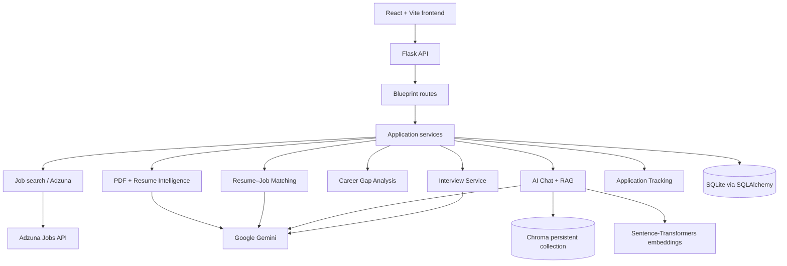
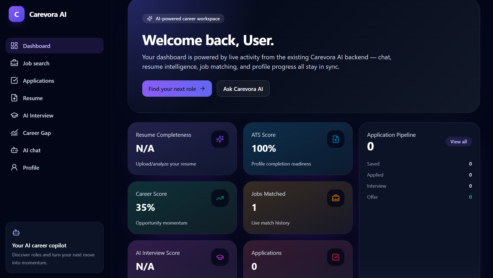
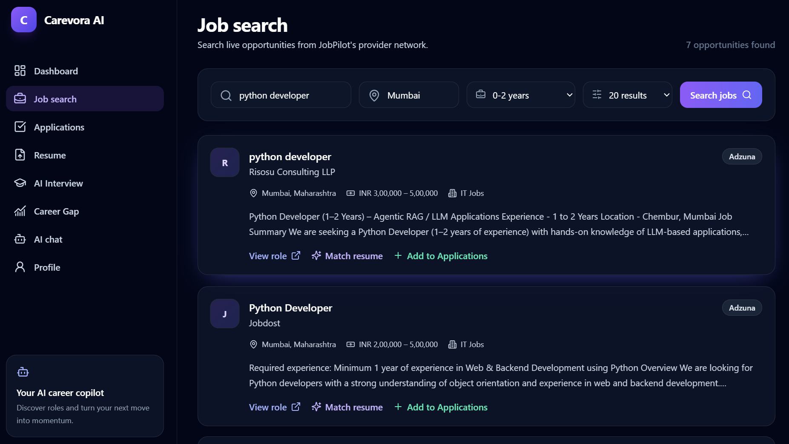
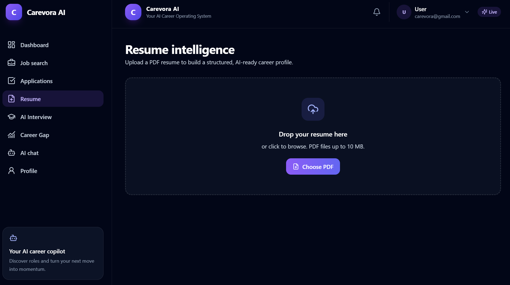
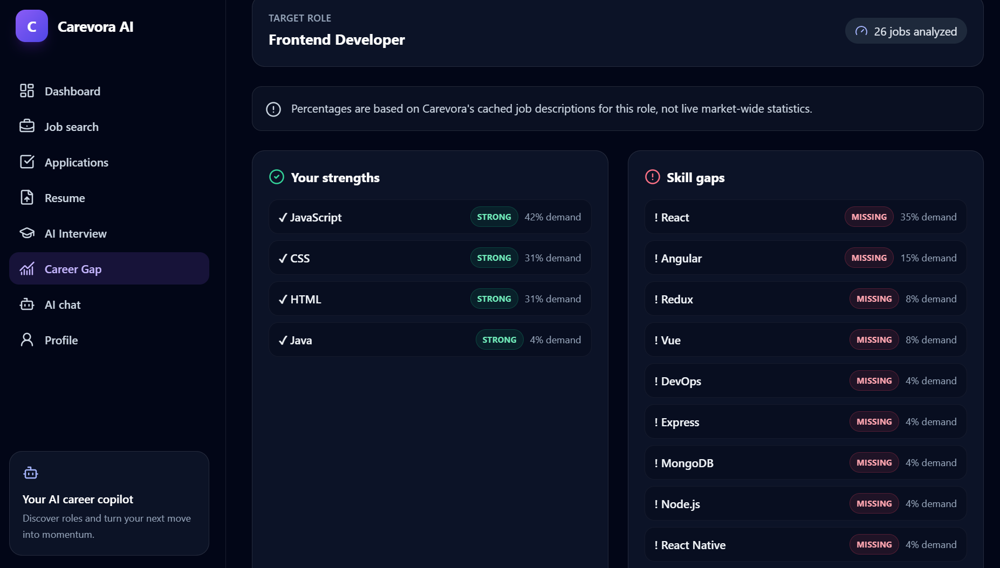
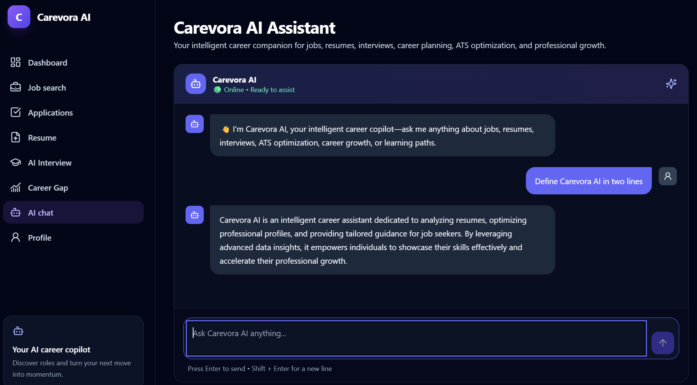
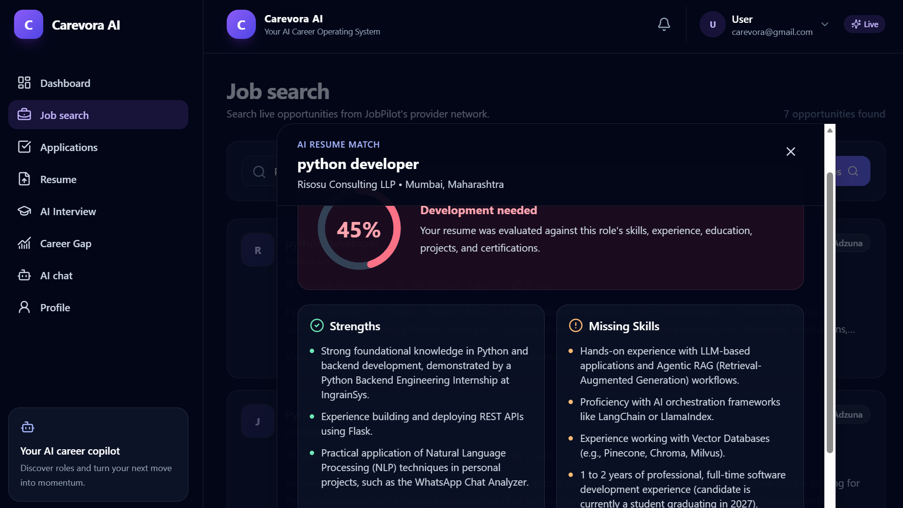
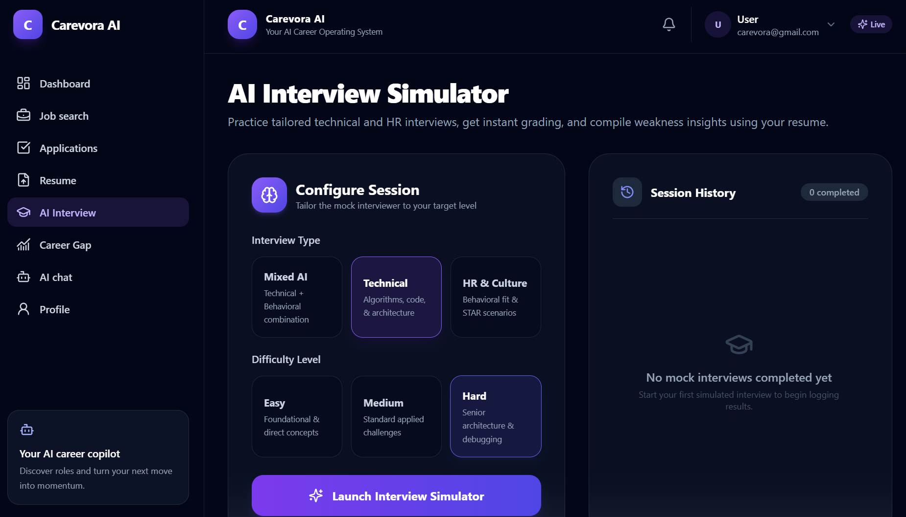

# Carevora AI

**A career copilot that connects job discovery, resume intelligence, role-fit analysis, and interview practice in one workflow.**

Career preparation often lives across disconnected tools: a resume file in one place, job boards in another, and interview notes somewhere else. Carevora AI brings those activities together around a user's resume and the roles they are exploring.

The platform supports authenticated users in searching for jobs, uploading and analyzing a PDF resume, comparing that resume with a selected job, identifying skills demanded by relevant listings, practicing tailored interview questions, and tracking applications. Its AI-assisted features use structured resume and job data rather than treating the career workflow as a single free-form chat.

Combining these steps makes the output of one activity useful to the next: a parsed resume can power matching, career-gap analysis, context-aware chat, and interview preparation; searched jobs can be cached for later analysis and matching.

## Core workflow

```text
Resume PDF
   ↓
Resume Intelligence
   ↓
Job Discovery
   ↓
Resume–Job Matching
   ↓
Career Gap Analysis
   ↓
Learning Path
   ↓
Interview Preparation / Application Tracking
```

## Key features

| Feature | What it does |
| --- | --- |
| Job search | Searches the configured job provider by keyword and optional location, with experience filtering. |
| Resume intelligence | Extracts text from a PDF resume and produces structured candidate information. |
| Resume–job matching | Generates a role-fit result for a completed resume analysis and a cached job listing. |
| Career Gap Analyzer | Compares a target role's analyzed job listings with the user's resume skill evidence. |
| AI Career Copilot | Answers general and career-oriented questions, using retrieved stored context where appropriate. |
| Interview practice | Runs a five-question HR, technical, or mixed mock interview tailored to the parsed resume. |
| Application tracking | Stores jobs and tracks their progress through application stages. |
| Dashboard | Provides user-scoped activity, match, recommendation, and application summary data. |

## Career Gap Analyzer

The Career Gap Analyzer is designed for role exploration rather than a fixed catalog of job titles. A user can enter an arbitrary target role; Carevora normalizes and compares that role against the titles, and when needed categories, of available cached listings.

```text
User Resume
   ↓
Target Role
   ↓
Relevant Job Listings
   ↓
Skill Extraction
   ↓
Skill Demand
   ↓
Resume Comparison
   ↓
Strong / Weak / Missing
   ↓
Career Gaps
   ↓
Learning Path
```

### How it works

1. A user uploads a text-based PDF and waits for Resume Intelligence to complete.
2. The user enters a target role of their choice.
3. Carevora first reuses matching cached job listings, selecting up to 100 relevant jobs.
4. If fewer than five relevant cached listings are found, it invokes the existing job-search path for the target role. Search results are cached for subsequent matching and analysis.
5. Skills are detected in each relevant job's title, description, skill list, and category using the repository's skill-alias rules.
6. Detected job skills are compared with the resume's explicit skills and with skill evidence found in its experience, projects, and certifications.
7. The result separates strengths and gaps and returns a learning path for the leading gap items when curriculum steps are available.

Demand percentages represent the analyzed job listings, not the whole job market. When fewer than five relevant jobs are available, Carevora reports the job count but withholds demand percentages instead of presenting a percentage from a small sample. It also distinguishes a provider being unavailable from a genuine search that returns no matching jobs; when cached data exists during a provider outage, that available cache can still be analyzed.

## AI Career Copilot

Carevora includes an AI chat experience for general career questions, resume questions, job-related questions, and interview or application guidance.

The chat service uses intent-aware routing:

- General questions are sent directly to the configured Gemini model.
- Resume-oriented questions retrieve the authenticated user's resume and resume-intelligence context when available.
- Job-oriented questions can retrieve both the user's stored context and shared cached job-description context.
- Other career questions use user-scoped retrieved context when relevant, while still allowing general career guidance if the stored context is incomplete.

Retrieved context is indexed with sentence-transformer embeddings in a persistent Chroma collection. RAG responses include the retrieved source metadata, and the streaming chat route sends answer deltas through Server-Sent Events.

## Job search

Job Search queries the configured provider integration using a keyword, optional location, page, and result-count selection. The current provider manager enables the Adzuna provider, and returned results are cached in the application's job-listing store.

The interface offers these experience selections: **Any experience**, **0–1 years**, **0–2 years**, **1–3 years**, **2–5 years**, **3–5 years**, **5–8 years**, and **8+ years**. The backend parses experience language found in job result text and filters listings whose stated range overlaps the selected range. It is search and filtering functionality, not an eligibility guarantee.

Example search:

```text
Python Developer + Chennai + 0–2 years
```

Cached results make later resume matching and career-gap analysis possible. Provider or network failures are surfaced as temporary search errors rather than being treated as zero job results.

## Resume Intelligence & Matching

### Resume Intelligence

Users can upload a PDF resume. The backend validates the file, extracts selectable PDF text with PyMuPDF, and asks Gemini for a validated structured result. The stored intelligence includes:

- Contact information
- Skills
- Education
- Experience
- Projects
- Certifications

An unreadable PDF or a PDF without extractable text cannot be analyzed. Resume analysis is associated with the authenticated user, and stored resumes can be downloaded or deleted by their owner.

### Resume–Job Matching

For a completed resume analysis and an existing cached job, Carevora sends structured resume information and job information to Gemini for comparison. The validated response contains:

- Match score
- Matching strengths
- Missing skills
- Prioritized recommendations
- Learning roadmap

Completed match results are stored in the dashboard history and can be indexed for later user-scoped retrieval.

## Interview preparation

Interview Preparation uses the latest successfully parsed resume to create a five-question mock interview. Users can choose an **HR**, **Technical**, or **Mixed** interview and an **Easy**, **Medium**, or **Hard** difficulty.

Each submitted answer receives a score and feedback. After the final question, the service creates a report with an overall score, strengths, weaknesses, suggestions, and a summary. If immediate AI answer evaluation is unavailable, the session can continue with a fallback response; the final report also has a fallback based on available scores.

## Application tracking

The application tracker lets authenticated users create, update, view, and remove their own application records. Each record can include a company, job title, status, dates, notes, and a job link.

Supported statuses are `Saved`, `Applied`, `Online Assessment`, `Interview`, `Offer`, and `Rejected`. Job Search can add a selected job to the tracker as `Saved`.

## System architecture



## Tech stack

| Layer | Technologies |
| --- | --- |
| Frontend | React, Vite, React Router, Axios, Tailwind CSS, Framer Motion, Lucide React |
| Backend | Python, Flask, Flask-CORS, Flask-SQLAlchemy, Pydantic |
| AI/ML | Google Gen AI SDK (Gemini), Sentence-Transformers, ChromaDB |
| Document processing | PyMuPDF |
| Database/storage | SQLite, SQLAlchemy, local upload storage, persistent Chroma data |
| External services | Adzuna Jobs API, Google Gemini API |
| Development tools | npm, Vite, Python virtual environments |

## Project structure

```text
Carevora AI/
├── frontend/                 # React + Vite client
│   └── src/
│       ├── pages/            # Dashboard, search, resume, chat, gap, interview views
│       ├── components/       # Layout and feature UI components
│       └── api/              # Frontend API client
├── routes/                   # Flask API blueprints
├── services/                 # Business logic and AI/RAG services
├── providers/                # Job-provider integrations
├── models/                   # SQLAlchemy models and request-facing data models
├── database/                 # SQLAlchemy extension setup
├── resume/                   # PDF parsing helpers
├── tests/                    # Experience and career-gap tests
├── tools/                    # Job-search integration entry point
├── app.py                    # Flask application factory and entry point
├── config.py                 # Environment-backed settings
├── requirements.txt          # Python dependencies
└── README.md
```

## Local development setup

### Prerequisites

- Python 3 with `venv`
- Node.js and npm
- A Gemini API key for AI-backed resume, matching, chat, and interview features
- Adzuna credentials for job search

### 1. Clone and enter the repository

```bash
git clone <repository-url>
cd JobPilot
```

### 2. Create and activate a Python environment

Windows PowerShell:

```powershell
python -m venv venv
.\venv\Scripts\Activate.ps1
```

macOS/Linux:

```bash
python3 -m venv venv
source venv/bin/activate
```

### 3. Install backend dependencies

```bash
pip install -r requirements.txt
```

### 4. Configure backend environment variables

Create a local `.env` file in the repository root and set the required credentials. See [Environment variables](#environment-variables) for names.

### 5. Install frontend dependencies

```bash
cd frontend
npm install
```

Create `frontend/.env` from the provided `frontend/.env.example` when the frontend needs an explicit backend base URL.

### 6. Start the Flask backend

From the repository root, with the virtual environment active:

```bash
python app.py
```

The application entry point defaults to port `5000`; a `PORT` environment variable overrides it.

### 7. Start the frontend

In another terminal:

```bash
cd frontend
npm run dev
```

Vite is configured for port `5173` and proxies API requests to the local Flask backend. The provided frontend environment example sets `VITE_API_BASE_URL=http://127.0.0.1:5000`.

## Environment variables

Never commit real credentials. The following names are read by the current implementation:

| Variable | Purpose |
| --- | --- |
| `SECRET_KEY` | Flask secret key. |
| `DATABASE_URL` | SQLAlchemy database connection URL. |
| `UPLOAD_FOLDER` | Local directory for uploaded resumes. |
| `MAX_UPLOAD_SIZE_BYTES` | Maximum upload size in bytes. |
| `LOG_LEVEL` | Application logging level. |
| `TOKEN_TTL_DAYS` | Authentication-token lifetime. |
| `GEMINI_API_KEY` | Google Gemini API credential. |
| `GEMINI_MODEL` | Gemini model identifier. |
| `GEMINI_TIMEOUT_SECONDS` | Configured Gemini timeout setting. |
| `CHROMA_PERSIST_DIRECTORY` | Persistent Chroma data directory. |
| `EMBEDDING_MODEL` | Sentence-Transformers embedding model name. |
| `ADZUNA_APP_ID` | Adzuna application ID. |
| `ADZUNA_APP_KEY` | Adzuna application key. |
| `PORT` | Optional Flask server port override. |
| `FLASK_ENV` | Used when selecting production cookie defaults. |
| `SESSION_COOKIE_SAMESITE` | Flask session cookie SameSite setting. |
| `SESSION_COOKIE_SECURE` | Whether Flask session cookies require HTTPS. |
| `VITE_API_BASE_URL` | Frontend API base URL (in `frontend/.env`). |

## API overview

Most feature endpoints require an authenticated user. The frontend sends a bearer token after registration or login.

| Area | Endpoint | Purpose |
| --- | --- | --- |
| Health | `GET /health` | Lightweight service health check. |
| Authentication | `POST /api/auth/register`, `POST /api/auth/login` | Register or log in. |
| Resume | `POST /api/users/:user_id/resumes` | Upload and analyze a PDF resume. |
| Jobs | `POST /api/jobs/search` | Search provider-backed jobs. |
| Matching | `POST /api/jobs/match` | Match a completed resume to a cached job. |
| Career gap | `POST /api/career-gap/analyze` | Analyze a target role against the user's resume. |
| Chat | `POST /api/chat/rag`, `POST /api/chat/stream` | Retrieve-aware chat and streamed chat. |
| Interview | `POST /api/interview/start`, `POST /api/interview/answer` | Start and progress through a mock interview. |
| Applications | `GET/POST /api/applications` | List or create application records. |

## Career-gap methodology

For each detected skill, the displayed demand percentage is calculated from the role-relevant listings that were analyzed:

```text
Demand % = (jobs mentioning a skill / total relevant jobs analyzed) × 100
```

Carevora classifies each demanded skill as follows:

| Classification | Definition |
| --- | --- |
| Strong | The skill is explicitly present in the resume's extracted skill inventory. |
| Weak | The skill has evidence in extracted experience, projects, or certifications, but is not in the explicit skill inventory. |
| Missing | The skill is demanded by analyzed jobs and is not found in the resume intelligence. |

The methodology is a practical comparison of resume intelligence and the listings available to the application. It does not measure broad market demand, validate proficiency, or replace a recruiter's assessment.

## 📸 Screenshots

### Dashboard

Central Carevora AI career workspace showing resume completeness, ATS readiness, career score, matched jobs, applications, and AI career assistance.



### Job Search

Search opportunities by keyword, location, and experience level, match your resume against jobs, review match insights, and add relevant opportunities to Applications.



### Resume Intelligence

Parse and organize resume information including skills, experience, education, projects, and certifications.



### Career Gap Analyzer

Analyze any target role against cached job listings to identify skill demand, resume strengths, weak and missing skills, and a recommended learning path.



### AI Career Copilot

AI-powered assistance for career questions, resume guidance, interview preparation, and learning.



### Resume–Job Matching

Match a resume against a specific job, review the match score and missing skills, and use the insights before adding the opportunity to Applications.



### AI Interview

Interactive AI-powered mock interview experience with interview practice and evaluation.



## Current limitations

- Job discovery depends on the configured provider, its credentials, and network availability.
- Job listings are currently sourced through the Adzuna provider integration configured in the provider manager.
- Career-gap demand statistics reflect only the analyzed relevant listings; small samples do not receive demand percentages.
- Skill detection is based on a defined alias set and job-description text, so it can miss terminology outside that vocabulary or context.
- Resume Intelligence requires a readable, text-based PDF and the configured Gemini service.
- AI-generated outputs depend on availability of the Gemini API and can return temporary-service errors.
- RAG retrieval depends on the optional ChromaDB and Sentence-Transformers dependencies being importable.

## Roadmap

The following are future ideas, not current features:

- **Planned:** Extend the skill taxonomy and alias coverage.
- **Planned:** Add richer career-readiness views beyond the existing match and interview outputs.
- **Planned:** Improve learning-path depth and customization.
- **Planned:** Support side-by-side target-role comparison.
- **Planned:** Add user-managed skill-progress tracking.
- **Planned:** Expand market-intelligence views while preserving clear sample and source context.

## License

No license file is currently included in this repository. A license can be added when the intended usage and distribution terms are decided.

## Closing

Carevora AI is built around a simple career workflow:

**Discover → Understand → Improve → Prepare → Apply → Grow**
